# Create Apache Spark Cluster Menggunakan Docker
#### Note : Pada dokumentasi ini saya menggunakan arch linux


## Persiapan
1. install docker `sudo pacman docker`
2. install docker-compose `sudo pacman docker-compose`

## Langkah-langkah pembuatan kluster spark
1. Buat direktori spark `mkdir spark`
2. Lalu buat konfigurasi spark docker-compose.yml dan isikan kode seperti dibawah
    ```
    version: '2'

    services:
      spark:
        image: bitnami/spark:2
        environment:
          - SPARK_MODE=master
          - SPARK_RPC_AUTHENTICATION_ENABLED=no
          - SPARK_RPC_ENCRYPTION_ENABLED=no
          - SPARK_LOCAL_STORAGE_ENCRYPTION_ENABLED=no
          - SPARK_SSL_ENABLED=no
        ports:
          - '8080:8080'
      spark-worker-1:
        image: bitnami/spark:2
        environment:
          - SPARK_MODE=worker
          - SPARK_MASTER_URL=spark://spark:7077
          - SPARK_WORKER_MEMORY=1G
          - SPARK_WORKER_CORES=1
          - SPARK_RPC_AUTHENTICATION_ENABLED=no
          - SPARK_RPC_ENCRYPTION_ENABLED=no
          - SPARK_LOCAL_STORAGE_ENCRYPTION_ENABLED=no
          - SPARK_SSL_ENABLED=no
      spark-worker-2:
        image: bitnami/spark:2
        environment:
          - SPARK_MODE=worker
          - SPARK_MASTER_URL=spark://spark:7077
          - SPARK_WORKER_MEMORY=1G
          - SPARK_WORKER_CORES=1
          - SPARK_RPC_AUTHENTICATION_ENABLED=no
          - SPARK_RPC_ENCRYPTION_ENABLED=no
          - SPARK_LOCAL_STORAGE_ENCRYPTION_ENABLED=no
          - SPARK_SSL_ENABLED=no
    ```
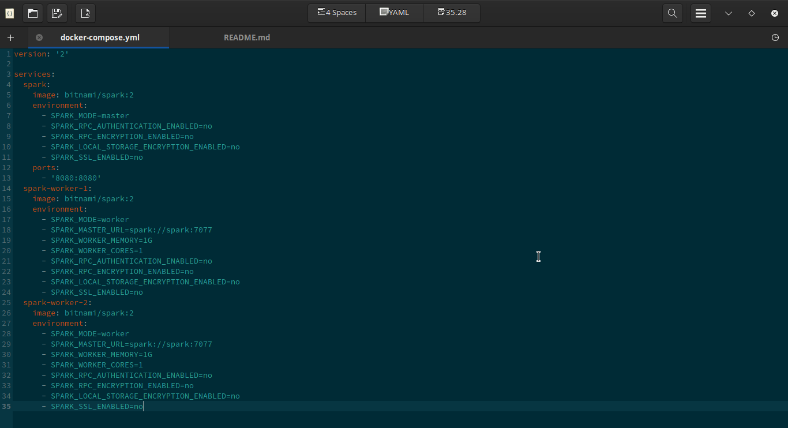
    
Pada konfigurasi diatas kita akan membuat spark yang memiliki 2 worker. Pada setiap worker memiliki terhubung dengan spark dan memiliki resource memori sebesar 1 Gb dan core yang dialokasikan 1. Hal ini diatur dalam baris berikut
```
    - SPARK_MASTER_URL=spark://spark:7077
    - SPARK_WORKER_MEMORY=1G
    - SPARK_WORKER_CORES=1
```
### Note
Jika anda ingin menambahkan worker anda cukup mendefinisikan worker ke 3, 4 dst sesuai kebutuhan
```
    spark-worker-3:
        image: bitnami/spark:2
        environment:
          - SPARK_MODE=worker
          - SPARK_MASTER_URL=spark://spark:7077
          - SPARK_WORKER_MEMORY=1G
          - SPARK_WORKER_CORES=1
          - SPARK_RPC_AUTHENTICATION_ENABLED=no
          - SPARK_RPC_ENCRYPTION_ENABLED=no
          - SPARK_LOCAL_STORAGE_ENCRYPTION_ENABLED=no
          - SPARK_SSL_ENABLED=no
```

3. Lalu run docker konfigurasi dengan perintah 'docker-compose up' untuk menjalankan cluster yg telah kita buat
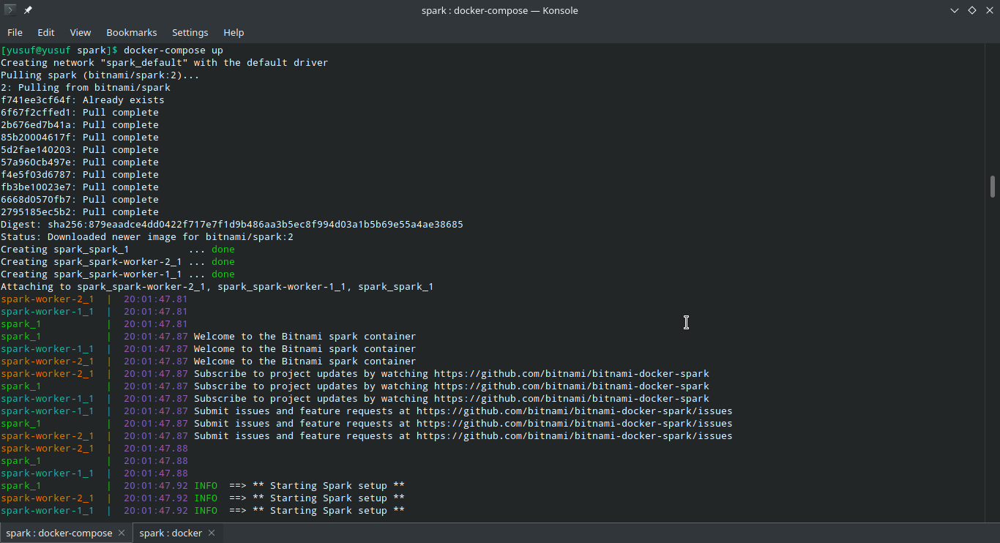

4. Untuk mengecek apakah kluster sudah berjalan kita dapat menggunkan command 'docker ps'
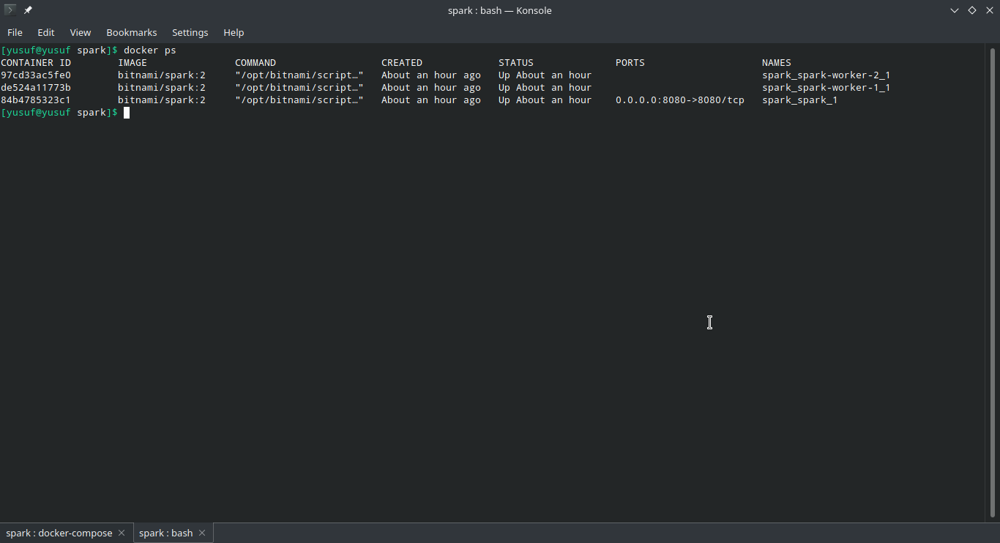

## Langkah-langkah menjalankan Script Python di Dalam Apache Spark Cluster
1. Buka terminal dan cek container yang sedang berjalan dengan perintah `docker ps`

### Note
Perhatikan container ID dari spark_spark_1. Kita akan masuk ke dalam container tersebut dan menjalankan spark-submit.

2. Masuklah ke dalam container dan mengeksekusi bash dengan menggunakan perintah `docker exec -it <container_id> /bin/bash`. Container id dapat dilihat pada langkah pertama
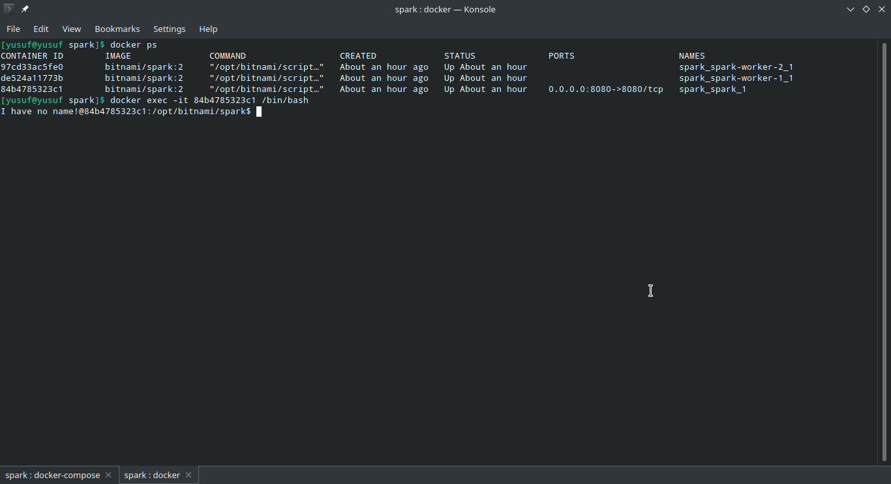

3. Cek ip dengan command `hostname -i`
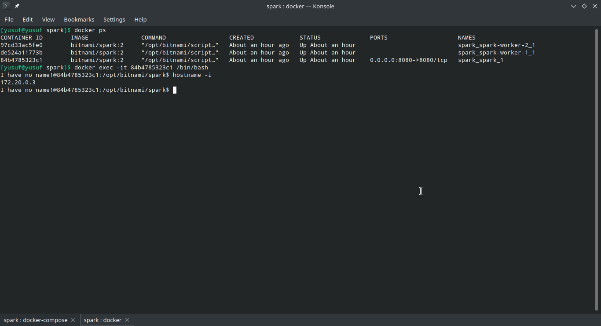
Alamat ip ini akan kita gunakan sebagai alamat apache spark master saat melakukan submit job

4. Untuk melakukan submit job, Apache Spark menyediakan command spark-submit. Saat melakukan submit job ke cluster, kita perlu mendefinisikan hal-hal berikut:
-   Alamat master node
-   Script atau kelas yang akan dijalankan
-   Data/file (apabila ada)

Sebagai contoh kita akan menghitung nilai Pi dengan script yang sudah disediakan oleh Apache Spark
masukkan perintah `spark-submit --master spark://<ip mater spark>:7077 examples/src/main/python/pi.py 10` dan tunggu sampai proses selesai
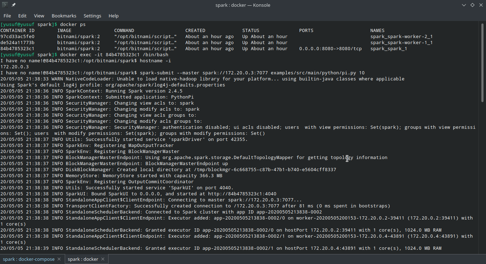

5. Amati jalannya aplikasi dari Spark Web UI (http://localhost:8080)
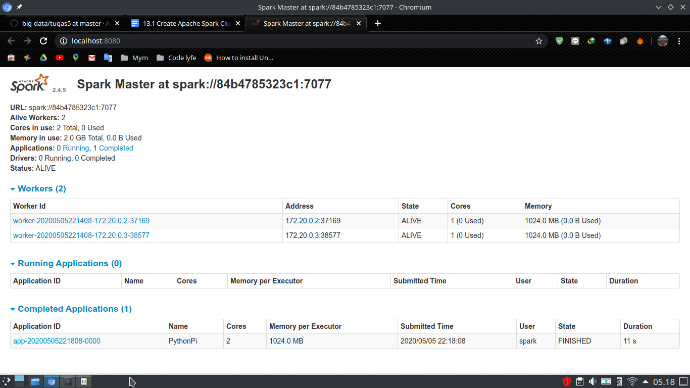
Hasil > 11 detik

6. Kita akan mencoba dengan parameter yang lebih besar dan mengamati perbedaanya
masukkan perintah `spark-submit --master spark://<ip mater spark>:7077 examples/src/main/python/pi.py 1000` dan tunggu sampai proses selesai
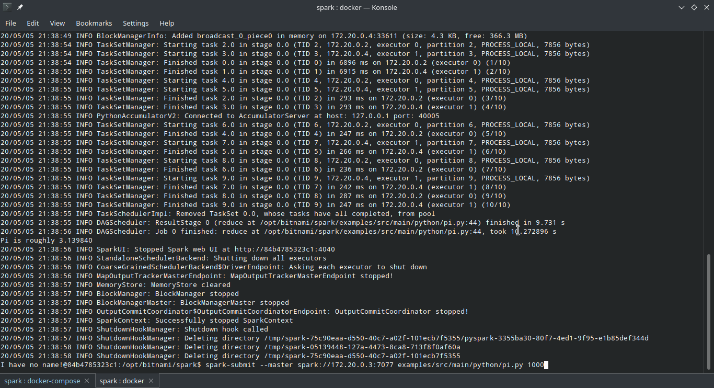

7. Amati jalannya aplikasi dari Spark Web UI (http://localhost:8080)
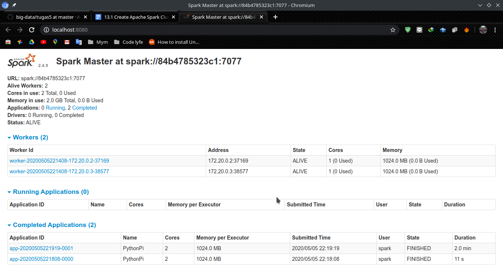)
Hasil > 2 menit

### Note
Script pi.py adalah script yang berisi program untuk menghitung estimasi nilai pi. Dalam contoh di atas, kita menggunakan parameter 10. Yang artinya adalah proses perhitungan/perulangan dipecah menjadi 10 bagian (10 job). Job-job inilah yang akan dijalankan oleh worker.

Karena jumlah jobnya hanya sedikit, maka prosesnya akan berjalan dengan cepat. Kalian bisa mencoba dengan mengganti jumlah job-nya menjadi lebih banyak. Semakin banyak jobnya, maka semakin lama prosesnya. Hal ini dikarenakan ada proses map-reduce antara master dan worker. Master akan membagi pekerjaan ke worker (proses map), dan mengumpulkan kembali hasilnya (reduce).


## Membandingkan kecepatan
Dengan menggunakan langkah-langkah didapatkan data seperti dibawah ini:

| Jumlah worker | Jumlah CPU | Partisi | Waktu run |
| ------------- | ------------- | ------------- | ------------- |
| 2  | 2 | 10 | 15 s |
| 2  | 2 | 1000 | 1,7 min |
| 2  | 4 | 10 | 12 s |
| 2  | 4 | 1000 | 1,7 min |
| 5  | 2 | 10 |  |
| 5  | 2 | 1000 |  |
| 5  | 4 | 10 |  |
| 5  | 4 | 1000 |  |

### Worker 2 core 2
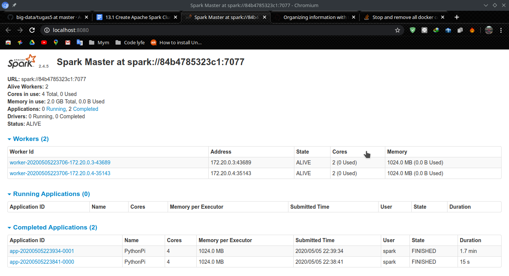)

### Worker 2 core 4
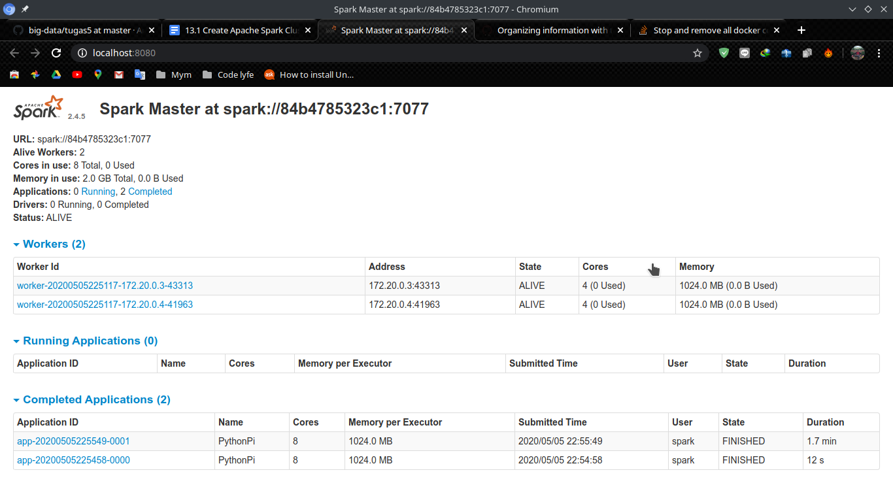)

### Worker 5 core 2
)

### Worker 5 core 4
)

## Kesimpulan
- Semakin banyak Job (Partisi) yang digunakan, maka proses overhead dari map-reduce akan semakin lama. Terlebih lagi jika jumlah worker banyak.
- Semakin banyak jumlah worker dan CPU Cores untuk setiap worker, maka proses pengerjaanya semakin cepat.
- Data kecil lebih bagus dikerjakan oleh worker yang sedikit, karena jika data besar untuk worker sedikit maka proses komputasi akan lama
- Data besar lebih bagus dikerjakan oleh worker yang banyak. Jika data kecil dikerjakan oleh banyak worker maka proses pembagian job akan lama


