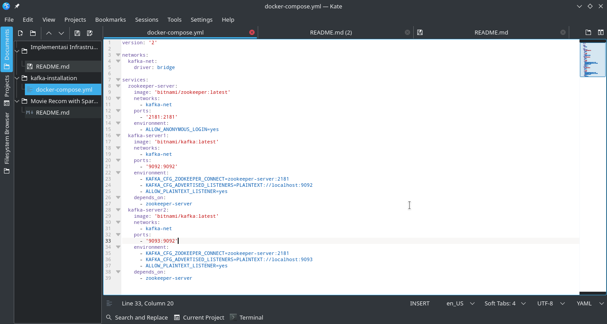
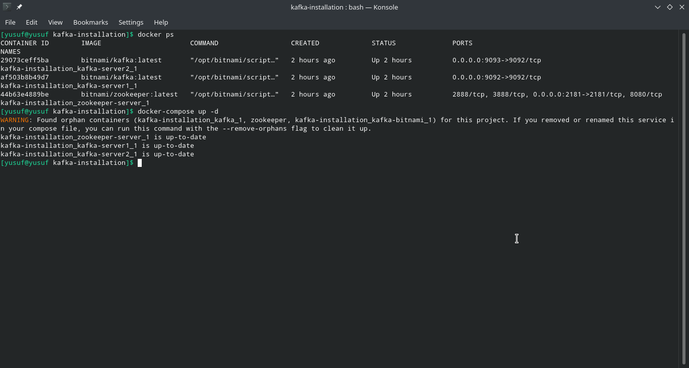
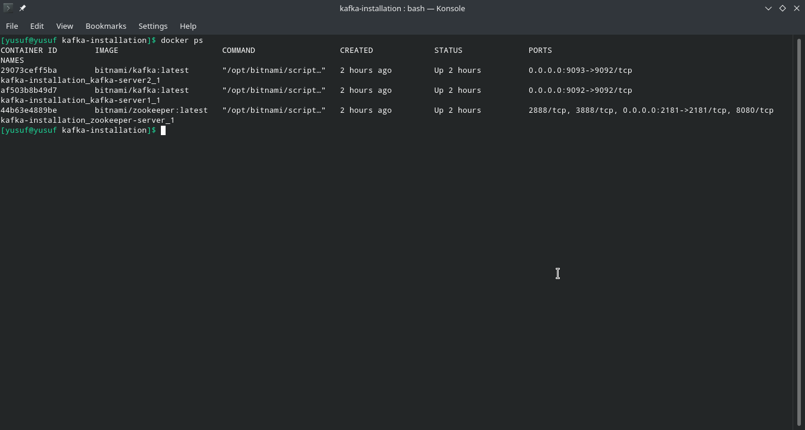
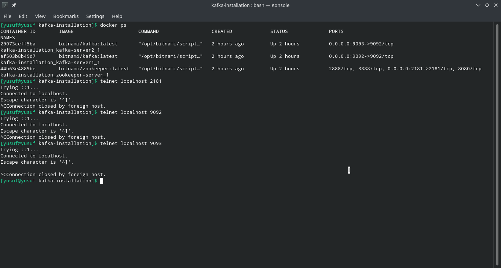
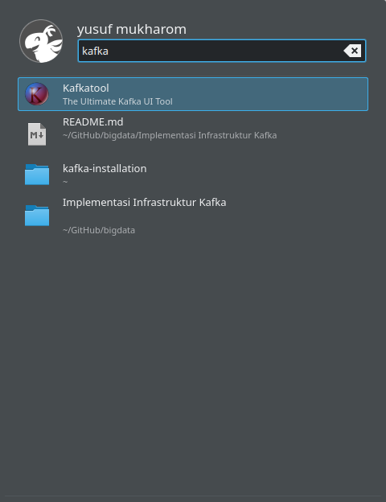
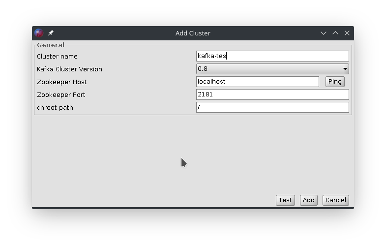
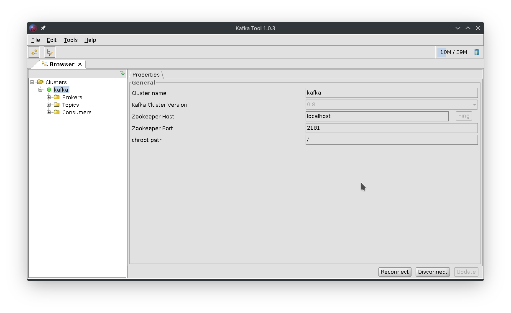

# Implementasi Kafka Docker
#### Note : Pada dokumentasi ini saya menggunakan arch linux dan kafkatool sebagai gui cek kafka


## Persiapan
1. install docker `sudo pacman docker`
2. install docker-compose `sudo pacman docker-compose`
3. install kafkatool
    - buka aplikasi pamac
    - search kafkatool
    - install / build

## Langkah-langkah instalasi kafka
1. Buat direktori kafka `mkdir karka-install`
2. Lalu buat konfigurasi kafka docker-compose.yml dan isikan kode seperti dibawah
    ```
    version: '2'

    networks:
    kafka-net:
        driver: bridge

    services:
    zookeeper-server:
        image: 'bitnami/zookeeper:latest'
        networks:
        - kafka-net
        ports:
        - '2181:2181'
        environment:
        - ALLOW_ANONYMOUS_LOGIN=yes
    kafka-server1:
        image: 'bitnami/kafka:latest'
        networks:
        - kafka-net    
        ports:
        - '9092:9092'
        environment:
        - KAFKA_CFG_ZOOKEEPER_CONNECT=zookeeper-server:2181
        - KAFKA_CFG_ADVERTISED_LISTENERS=PLAINTEXT://localhost:9092
        - ALLOW_PLAINTEXT_LISTENER=yes
        depends_on:
        - zookeeper-server
    kafka-server2:
        image: 'bitnami/kafka:latest'
        networks:
        - kafka-net    
        ports:
        - '9093:9092'
        environment:
        - KAFKA_CFG_ZOOKEEPER_CONNECT=zookeeper-server:2181
        - KAFKA_CFG_ADVERTISED_LISTENERS=PLAINTEXT://localhost:9093
        - ALLOW_PLAINTEXT_LISTENER=yes
        depends_on:
        - zookeeper-server
    ```

    
Pada konfigurasi diatas kita akan membuat zookeeper dengan port 2181:2181, dan 2 server kafka dengan localhost server pada port 9092 dan 9093. Dimana dalam zookeeper dan server kafka dihubungkan oleh networks bernama 'kafka-net'.

3. Lalu run docker konfigurasi dengan perintah 'docker-compose up -d' untuk menjalankan cluster yg telah kita buat


4. Untuk mengecek apakah kluster sudah berjalan kita dapat menggunkan command 'docker ps'

atau menggunakan telnet


## Connect dengan kafkatool gui
1. Buka aplikasi kafkatool

2. Add kluster dan isikan sesuai gambar dibawah

3. Klik kanan kluster yang telah kita buat dan connect. Maka kluster sudah terhubung dengan kafkatool



