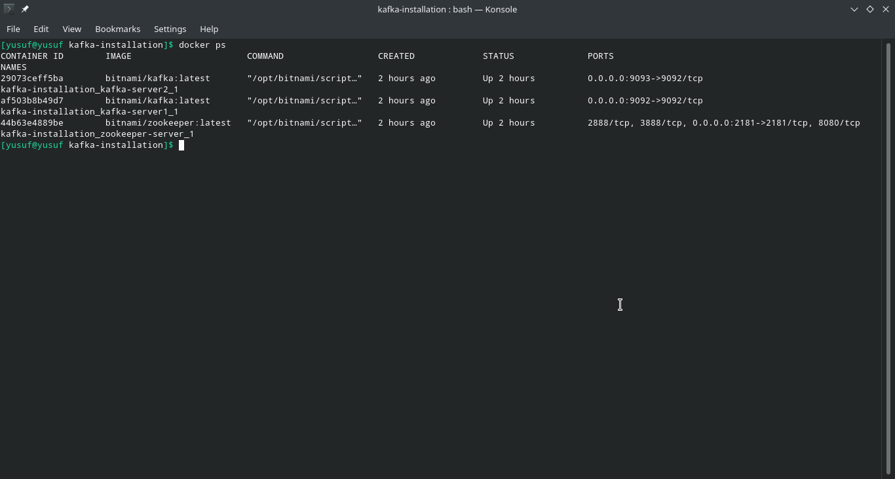
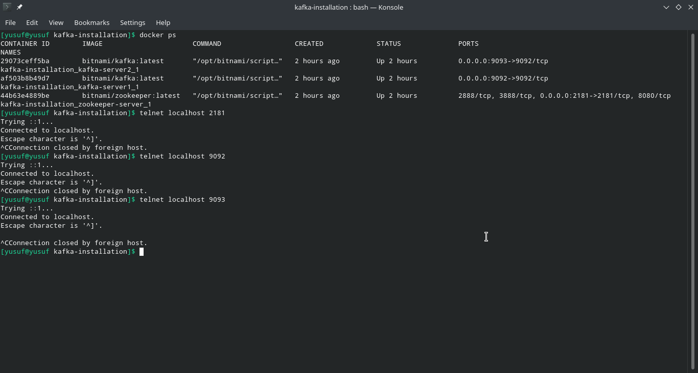
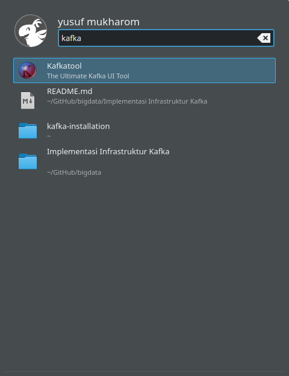

# Implementasi Kafka Docker
#### Note : Pada dokumentasi ini saya menggunakan arch linux dan kafkatool sebagai gui cek kafka


## Persiapan
1. install docker `sudo pacman docker`
2. install docker-compose `sudo pacman docker-compose`
3. install kafkatool
    - buka aplikasi pamac
    - search kafkatool
    - install / build

## Langkah-langkah instalasi kafka
1. Buat direktori kafka `mkdir karka-install`
2. Lalu buat konfigurasi kafka docker-compose.yml dan isikan kode seperti dibawah
    ```
    version: '2'

    networks:
    kafka-net:
        driver: bridge

    services:
    zookeeper-server:
        image: 'bitnami/zookeeper:latest'
        networks:
        - kafka-net
        ports:
        - '2181:2181'
        environment:
        - ALLOW_ANONYMOUS_LOGIN=yes
    kafka-server1:
        image: 'bitnami/kafka:latest'
        networks:
        - kafka-net    
        ports:
        - '9092:9092'
        environment:
        - KAFKA_CFG_ZOOKEEPER_CONNECT=zookeeper-server:2181
        - KAFKA_CFG_ADVERTISED_LISTENERS=PLAINTEXT://localhost:9092
        - ALLOW_PLAINTEXT_LISTENER=yes
        depends_on:
        - zookeeper-server
    kafka-server2:
        image: 'bitnami/kafka:latest'
        networks:
        - kafka-net    
        ports:
        - '9093:9092'
        environment:
        - KAFKA_CFG_ZOOKEEPER_CONNECT=zookeeper-server:2181
        - KAFKA_CFG_ADVERTISED_LISTENERS=PLAINTEXT://localhost:9093
        - ALLOW_PLAINTEXT_LISTENER=yes
        depends_on:
        - zookeeper-server
    ```

    
Pada konfigurasi diatas kita akan membuat zookeeper dengan port 2181:2181, dan 2 server kafka dengan localhost server pada port 9092 dan 9093. Dimana dalam zookeeper dan server kafka dihubungkan oleh networks bernama 'kafka-net'.

3. Lalu run docker konfigurasi dengan perintah 'docker-compose up -d' untuk menjalankan cluster yg telah kita buat


4. Untuk mengecek apakah kluster sudah berjalan kita dapat menggunkan command 'docker ps'

atau menggunakan telnet


## Connect dengan kafkatool gui
1. Buka aplikasi kafkatool <br>

2. Add kluster dan isikan sesuai gambar dibawah

3. Klik kanan kluster yang telah kita buat dan connect. Maka kluster sudah terhubung dengan kafkatool

