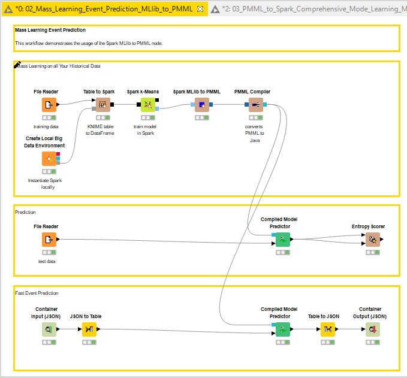
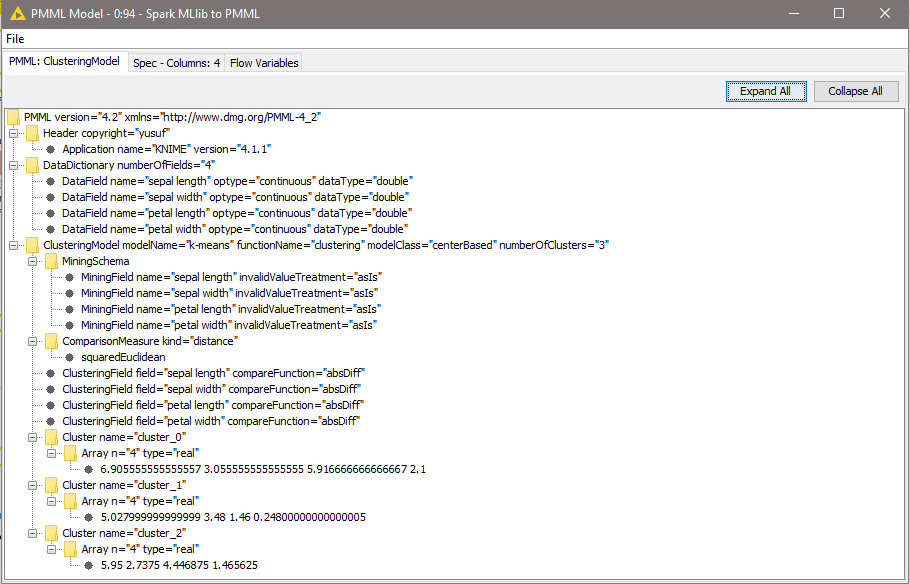
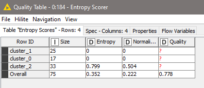
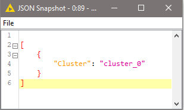
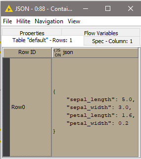
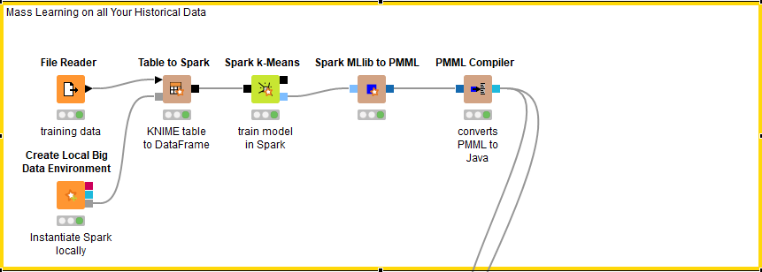
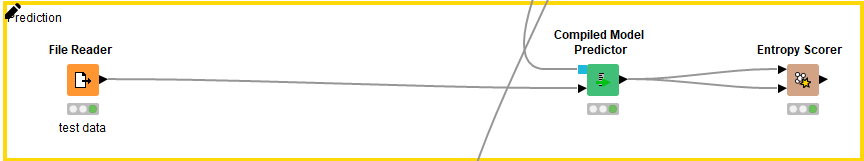
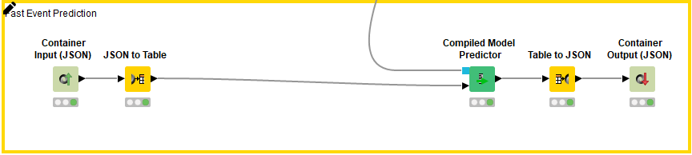
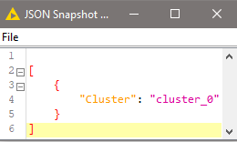

# MLlib model to PMML
Source resmi KNIME > https://hub.knime.com/knime/spaces/Examples/latest/10_Big_Data/02_Spark_Executor/02_Mass_Learning_Event_Prediction_MLlib_to_PMML

## Overview
1. Knime workflow  

2. Hasil MLlib model to PMML  

3. Hasil score prediction  

4. Hasil fast prediction  

## Dokumentasi
### Business Understanding
Workflow knime diatas mendemonstrasikan kegunaan Spark MLlib to PMML node. Bersama dengan Compiled Model Predictor dan JSON Input/Output node untuk membuat model lambda architecture untuk model machine learning untuk memprediksi data offline atau data onlie baru ang didapatkan

### Data Understanding

Data yang akan kita gunakan adalah data iris yang dibagi menjadi dua file utama yang akan kita gunakan sebagai data training dan data testing dengan keterangan sebagai berikut :

1. Data iris (data_training.csv & data_testing.csv)
Dataset training.csv & data_testing.csv memiliki 75 data memiliki 5 kolom dengan keterangan :
  - sepal length = panjang sepal bunga
  - sepal width = lebar sepal bunga
  - petal length = panjang petal bunga
  - petal width = lebar petal bunga
  - class = jenis bunga iris (Iris-Setosa, Iris-Versicolour, Iris-Virginica)  
Kedua data memiliki struktur sama hanya isi datanya saja yang berbeda

### Data Preparation

Tahapan ini tidak terlalu diterapkan pada workflow knime kali ini. Dikarenakan data iris sudah bersih dan tidak perlu dirubah untuk menyesuaikan tahapan modeling. Data inputan dari user berupa file json yang memiliki 4 atribut (sepal & petal)

### Modelling

Pada tahap ini kita akan membuat modeling yang akan digunakan sebagai dasar pembuatan lambda architecture untuk machine learning. .
MLlib model to PMML diimplementasikan untuk mengkonversi model MLlib pada spark menjadi PMML untuk prediksi data.

#### Langkah - langkah modelling
1. Create Local Big Data Environment > Membuat semua fungsi local big data environment diantaranya Apache Hive, Apache Spark dan HDFS.
2. File reader > Membaca file csv data_training 
3. Table to Spark > Membuat Spark DataFrame/RDD dari table knime. Node ini akan mengubah inputan user menjadi Dataframe/RDD Spark
4. Spark k-Means > Mengaplikasikan algoritma apache spark k-Means pada tabel yang telah dibaca
5. Spark MLlib to PMML  > Mengkonversi apache spark MLlib menjadi Model PMML
6. PMML Compiler > Mentranslate PMML model menjadi Java bytecode yang dapat dieksekusi oleh Compiled Model Predictor pada tahapan selanjutnya

Selesai langkah diatas maka dihasilkan Compiled Model yang siap diuji cobakan ke data testing dan data inputan

### Evaluation

Proses selanjutnya kita akan mengevaluasi apakah modeling sudah memberikan hasil yang baik. Model yang telah didapatkan pada tahapan modeling dites menggunakan data_testing.csv menggunakan Compiled Model Predictor untuk memprediksi cluster dan melihat kulaitas model dengan node Entropy Scorer.

#### Langkah-langkah evaluasi
1. File reader > Membaca file csv data_testing
2. Compiled Model Predictor > Memprediksi class data_testing dengan menggunakan model yang telah dibuat
3. Entropy Scorer > Menghitung score clustering

Jika value sudah mendekati, maka model sudah benar dan siap untuk digunakan sebagai model klustering

### Deployment

Model yang sudah dievaluasi akan digunakan sebagai prediksi dalam inputan fast (dapat berupa online) lainya yang belum diklasifikasikan. Dengan menggunakan Compiled Model Predictor kita akan memprediksi kelas dari data yang diberikan.

#### Langkah-langkah deployment
1. Container Input Json > Sebagai data inputan user berupa json
2. Json to Table > Mengubah inputan json menjadi table
3. Compiled Model Predictor > Memprediksi kelas dari data yang diberikan
4. Table to Json > Mengubah hasil cluster prediksi menjadi json file
5. Container Output (JSON) > Membaca isi json

Hasil  

