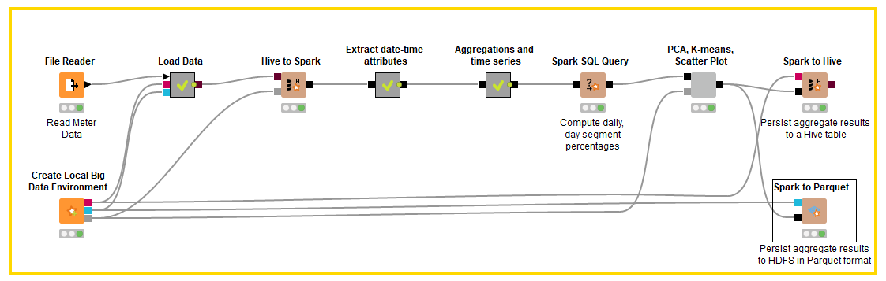

# Spark Compiled Model Predictor
Source resmi KNIME > https://kni.me/w/EKCJDBZmrX1j-2zL

## Overview
1. Knime workflow  

2. Hasil Spark Compiled Model Predictor  

3. Hasil score confusion matrix  

4. Hasil score accuracy statistic  

## Dokumentasi
### Business Understanding
Workflow knime diatas mendemonstrasikan penggunaan Spark Compiled Model Predictor node untuk mengkonversi PMML model menjadi machine code yang akan digunakan oleh Spark Compiled Model Predictor untuk memprediksi data besar secara pararel dengan Apache Spark

### Data Understanding

Data yang akan kita gunakan adalah data iris yang dibagi menjadi dua file utama yang akan kita gunakan sebagai data training dan data testing dengan keterangan sebagai berikut :

1. Data iris (data_training.csv & data_testing.csv)
Dataset training.csv & data_testing.csv memiliki 75 data memiliki 5 kolom dengan keterangan :
  - sepal length = panjang sepal bunga
  - sepal width = lebar sepal bunga
  - petal length = panjang petal bunga
  - petal width = lebar petal bunga
  - class = jenis bunga iris (Iris-Setosa, Iris-Versicolour, Iris-Virginica)  
Kedua data memiliki struktur sama hanya isi datanya saja yang berbeda

### Data Preparation

Tahapan ini tidak terlalu diterapkan pada workflow knime kali ini. Dikarenakan data iris sudah bersih dan tidak perlu dirubah untuk menyesuaikan tahapan modeling. Data inputan dari user berupa file json yang memiliki 4 atribut (sepal & petal)

### Modelling

Pada tahap ini kita akan membuat modeling yang akan digunakan sebagai dasar prediksi Spark Compiled Model Predictor. Spark Compiled Model Predictor diimplementasikan untuk memprediksi class dari data testing.

#### Langkah - langkah modelling
1. File reader > Membaca file csv data_training 
2. Decision Tree Learner > Membuat model decision tree dari data training
3. RProp MLP Learner > Membuat model MLP (Neural Network) dari data training
4. PMML to Cell > Mengkonversi PMML Port menjadi table yang berisi PMMl cell
5. Concatenate > Menggabungkan dua table decision tree model dan table MLP model
6. Table to PMML Ensemble > mengubah table dari PMML dokumen bentuk tree menjadi satu PMML dokumen berisi semua model tree dari input
7. PMML Compiler > Mentranslate PMML model menjadi Java bytecode yang dapat dieksekusi oleh Compiled Model Predictor pada tahapan selanjutnya

Selesai langkah diatas maka dihasilkan Compiled Model yang siap diuji cobakan ke data testing

### Evaluation

Proses selanjutnya kita akan mengevaluasi apakah modeling sudah memberikan hasil yang baik. Model yang telah didapatkan pada tahapan modeling dites menggunakan data_testing.csv menggunakan Spark Compiled Model Predictor untuk memprediksi cluster dan melihat kualitas model dengan node Scorer.

#### Langkah-langkah evaluasi
1. File reader > Membaca file csv data_testing
2. Create Local Big Data Environment > Membuat semua fungsi local big data environment diantaranya Apache Hive, Apache Spark dan HDFS
3. Table to Spark > Membuat Spark DataFrame/RDD dari table knime. Node ini akan mengubah inputan user menjadi Dataframe/RDD Spark
4. Spark Compiled Model Predictor > Menjalankan kode java yang telah dibuat oleh node PMML Compiler pada Apache Spark
5. Spark to Table > Membaca Spark DataFrame/RDD dan mengkonversinya menjadi KNIME data table
6. Scorer > Membandingkan dua kolom atribut yang sama dan menampilkan confusion matrix

Jika value sudah mendekati, maka model sudah benar dan siap untuk digunakan sebagai model klustering

### Deployment

Tahapan ini tidak terlalu diimplementasikan pada workflow kali ini, Karena hasil dari model yang dievaluasi tidak diterapkan untuk memprediksi inputan. Hasil dari model juga tidak disimpan menjadi file apapun. 
