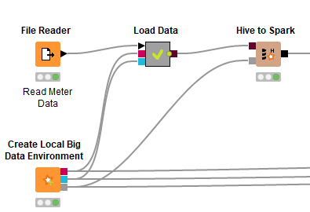
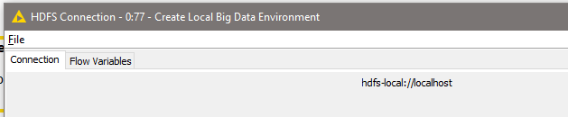
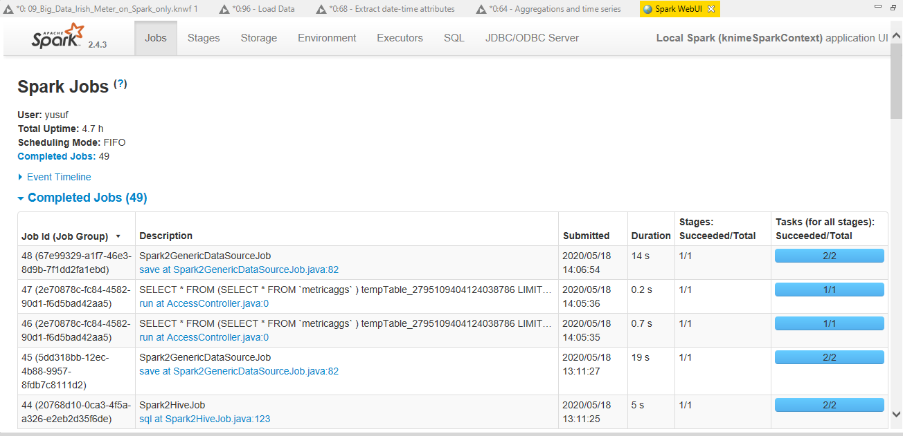
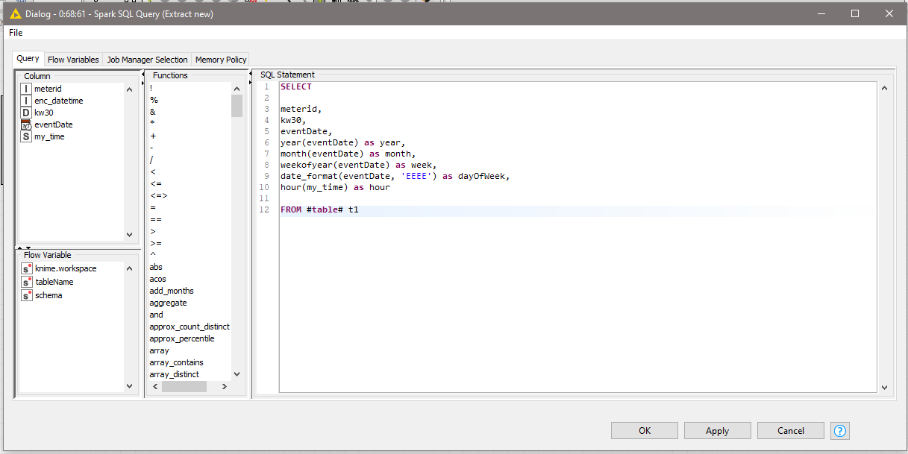
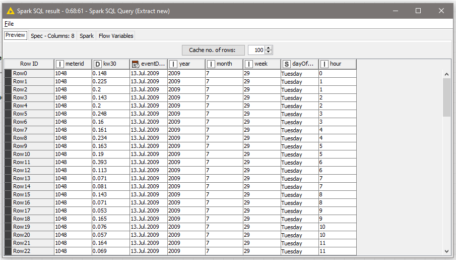

# Time Series - Analisis Kebutuhan Listrik di Irlandia
Source resmi KNIME > https://kni.me/w/W78o4CE7oGCRkf51

## Overview
1. Knime workflow  

2. Agregation and Time Series  

3. Hasil deploy spark  

4. Hasil deploy spark to parquet  

## Dokumentasi
### Business Understanding
Workflow knime diatas mendemonstrasikan penggunaan time series untuk menganalisa rata-rat penggunaan listrik di irlandia. Hasil time series dibagi menjadi 9 yaitu:
1. Total penggunaan listrik
2. Penggunaan listrik per tahun
3. penggunaan listrik per bulan
4. Penggunaan listrik per minggu
5. Penggunaan listrik tiap hari dalam seminggu (tiap senen, tiap selasa dst)
6. Penggunaan listrik per hari
7. Penggunaan listrik per segmen dalam hari (tiap kurun jam tertentu)
8. Penggunaan listrik per hari kerja dan hari libur
9. Penggunaan listrik tiap jam tertentu

### Data Understanding

Data yang akan kita gunakan adalah meters_01_50.csv dengan keterangan sebagai berikut :

Dataset memiliki 44 baris data yang memiliki 3 kolom atribut dengan keterangan :
  - meterID = id meteran listrik
  - enc_datetime = data tanggal yang terenkripsi.
  - reading = nilai meteran pada meteran listrik

### Data Preparation

Tahapan ini kita mengubah dataset ke hive mengubahnya menjadi spark. Dikarenakan data sudah cukup bersih maka kita tidak perlu mencari field null dll. Kita hanya untuk mempersiapkan data untuk tahapan modeling.

#### Langkah-langkah data preparation
1. File reader > Membaca dataset meter  

2. Create Local Big Data Environment > Membuat semua fungsi local big data environment diantaranya Apache Hive, Apache Spark dan HDFS  

3. Load data > Meload dataset meter menjadi hive

  - DB Table Connector > Membuat tabel database baru dari dataset yang telah dibaca

  - DB Loader > Meload data banyak dari database Hive

4. Hive to Spark > Mengimpor hasil dari query Hive inputan menjadi Spark sebagai DataFrame / RDD

### Modelling

Pada tahap ini kita akan mengolah DataFrame/RDD Spark hasil preparation dengan macam-macam spark sql node untuk menjabarkan kolom datetime menjadi bagian-bagian sesuai time series yang kita butuhkan.

#### Langkah - langkah modelling
1. Extract date-time atribut > Menjabarkan date time menjadi time series yg kita butuhkan. Node ini merupakan kumpulan Spark SQL Query dimana tiap querynya adalah sebagai berikut :
  - Initial datetime conversion
  
    Pada query diatas kolom reading akan di-rename menjadi kw30. Kemudian menambahkan kolom eventDate dan my_time. Berikut penjelasannya:
    - eventDate: hasil dari fungsi date_add (mengambil nilai interval antara tanggal 31-12-2008 dengan tiga digit pertama kolom enc_datetime).
    - my_time: mengambil nilai hh:mm, hh didapatkan dari ((digit ke-4 enc_datetime * 30) / 60 ) % 24. Diambil 2 digit dari hasil tersebut. sedangkan value mm, didapatkan dari ((digit ke-4 enc_datetime * 30) % 60 ) dan diambil 2 digit dari hasil tersebut.
  
  - Extract new datetime features
  
    Pada query diatas akan dihasilkan 5 kolom baru yaitu:
    - year: mendapatkan nilai tahun dari kolom eventDate
    - month: mendapatkan nilai bulan dari kolom eventDate
    - week: mendapatkan nilai minggu dari kolom eventDate
    - dayOfWeek: mendapatkan nilai nama hari dari kolom eventDate.
    - hour: mendapatkan nilai jam dari value pada kolom my_time.
  
  

### Evaluation

Proses selanjutnya kita akan mengevaluasi apakah modeling sudah memberikan hasil yang baik. Model yang telah didapatkan pada tahapan modeling dites menggunakan data_testing.csv menggunakan Spark Compiled Model Predictor untuk memprediksi cluster dan melihat kualitas model dengan node Scorer.

#### Langkah-langkah evaluasi
1. File reader > Membaca file csv data_testing
2. Create Local Big Data Environment > Membuat semua fungsi local big data environment diantaranya Apache Hive, Apache Spark dan HDFS
3. Table to Spark > Membuat Spark DataFrame/RDD dari table knime. Node ini akan mengubah inputan user menjadi Dataframe/RDD Spark
4. Spark Compiled Model Predictor > Menjalankan kode java yang telah dibuat oleh node PMML Compiler pada Apache Spark
5. Spark to Table > Membaca Spark DataFrame/RDD dan mengkonversinya menjadi KNIME data table
6. Scorer > Membandingkan dua kolom atribut yang sama dan menampilkan confusion matrix

Jika value sudah mendekati, maka model sudah benar dan siap untuk digunakan sebagai model klustering

### Deployment

Tahapan ini tidak terlalu diimplementasikan pada workflow kali ini, Karena hasil dari model yang dievaluasi tidak diterapkan untuk memprediksi inputan. Hasil dari model juga tidak disimpan menjadi file apapun. 
