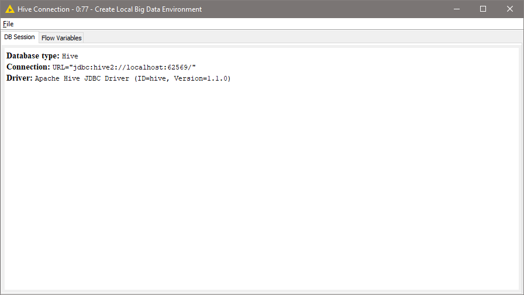
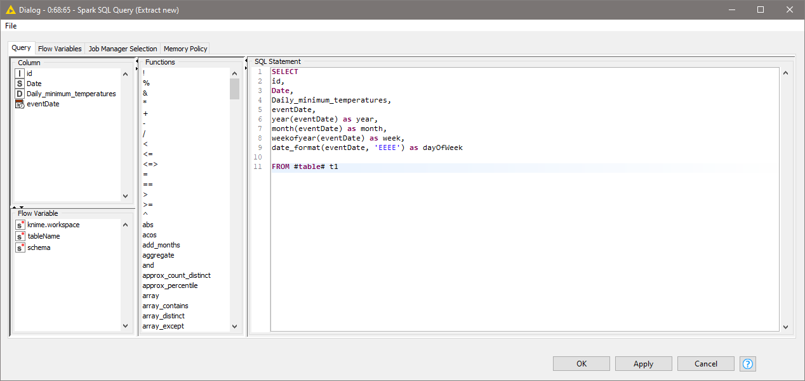

# Time Series - daily-minimum-temperatures-in-me
Source resmi KNIME > https://kni.me/w/W78o4CE7oGCRkf51

## Overview
Knime workflow  

## Dokumentasi
### Business Understanding
Workflow knime diatas mendemonstrasikan penggunaan time series untuk menganalisa rata-rata suhu. Hasil time series dibagi menjadi 9 yaitu:
1. Total suhu
2. Suhu per tahun
3. Suhu per bulan
4. Suhu per minggu
5. Suhu tiap hari dalam seminggu (tiap senen, tiap selasa dst)
6. Suhu per hari
7. Suhu per segmen dalam hari (tiap kurun jam tertentu)
8. Suhu per hari kerja dan hari libur
9. Suhu tiap jam tertentu

### Data Understanding

Data yang akan kita gunakan adalah dengan keterangan sebagai berikut :

Dataset memiliki 2650 baris data yang memiliki 3 kolom atribut dengan keterangan :
  - id = id data
  - Date = tanggal data diperoleh.
  - Daily_minimum_temperatures = nilai minimum suhu 

### Data Preparation

Tahapan ini kita mengubah dataset ke hive untuk diolah di spark.

#### Langkah-langkah data preparation
1. File reader > Membaca dataset meter  

2. Create Local Big Data Environment > Membuat semua fungsi local big data environment diantaranya Apache Hive, Apache Spark dan HDFS  

3. Load data > Meload dataset menjadi hive

  - DB Table Connector > Membuat tabel database baru dari dataset yang telah dibaca
  
  - DB Loader > Meload data banyak dari database Hive  
  
4. Hive to Spark > Mengimpor hasil dari query Hive inputan menjadi Spark sebagai DataFrame / RDD

### Modelling

Pada tahap ini kita akan mengolah DataFrame/RDD Spark hasil preparation dengan macam-macam spark sql node untuk menjabarkan date menjadi bagian-bagian sesuai time series yang kita butuhkan.

#### Langkah - langkah modelling
1. Extract date-time atribut > Menjabarkan date menjadi time series yg kita butuhkan. 
Node ini merupakan kumpulan Spark SQL Query dimana tiap querynya adalah sebagai berikut :

  - Initial datetime conversion
  
    Pada query diatas kita akan membuat kolom eventDate. Berikut penjelasannya:
    - eventDate: hasil dari kolom date yang dijabarkan menjadi timestamp.
  

  - Extract new datetime features
  
    Pada query diatas akan dihasilkan 5 kolom baru yaitu:
    - year: mendapatkan nilai tahun dari kolom eventDate
    - month: mendapatkan nilai bulan dari kolom eventDate
    - week: mendapatkan nilai minggu dari kolom eventDate
    - dayOfWeek: mendapatkan nilai nama hari dari kolom eventDate.
    - hour: mendapatkan nilai jam dari value pada kolom my_time.
  

  - Assign weekend / weekday
  
    Pada query diatas kita akan mendapatkan 1 kolom baru yaitu:
    - dayClassifier : Didapatkan ketika value dayOfWeek saturday / sunday maka dayClassifiernya `WE` selain itu dayClassifiernya `BD`
  

2. Aggregation and Time Series > Mendapatkan nilai rata-rata suhu tiap time series yang kita inginkan
Dalam node ini dilakukan proses agregasi dengan menggunakan node sparks. Node-node yang digunakan antara lain :
  - Presist Spark DataFrame/RDD > Untuk mencache spark DataFrame agar mempercepat operasi-operasi yang menggunakan dataframe yang sama
  - Spark GroupBy > Melakukan group data sesuai dengan index yang kita inginkan. Selain itu kita juga bisa melakukan agregasi (MEAN, AVG, SUM dsb) pada node ini
  - Spark Pivot > Melakukan pivoting pada Spark DataFrame / RDD yang diberikan menggunakan jumlah kolom yang dipilih untuk pengelompokan dan satu kolom untuk pivoting
  - Spark Coloumn Rename > Mengubah nama suatu kolom dari table
  - Spark Joiner > Menjoin 2 spark DataFrame seperti join pada database

Pada workflow diatas terdapat proses-proses :

  - Mencari total daily_minimum_temperature dengan cara:
    - SUM kolom daily minimum temperature dan groupby id dengan Spark GroupBy
    - Rename kolom hasil sum menjadi total dengan Spark Coloumn Rename
    Hasilnya menjadi  
    

  - Mencari rata-rata suhuk per tahun dengan cara:
    - MEAN kolom daily minimum temperature dan groupby id, year dengan Spark GroupBy
    - MEAN kolom MEAN(daily minimum temperature) dan groupby id dengan Spark GroupBy
    - Rename kolom hasil MEAN menjadi avgYearly dengan Spark Coloumn Rename
    Hasilnya menjadi  
    

  - Mencari rata-rata suhu per bulan dengan cara:
    - MEAN kolom daily minimum temperature dan groupby id, year, month dengan Spark GroupBy
    - MEAN kolom MEAN(daily minimum temperature) dan groupby id dengan Spark GroupBy
    - Rename kolom hasil MEAN menjadi avgMonthly
    Hasilnya menjadi  
    

  - Mencari rata-rata suhu per minggu dengan cara:
    - MEAN kolom daily minimum temperature dan groupby id, year, week dengan Spark GroupBy
    - MEAN kolom MEAN(daily minimum temperature) dan groupby id
    - Rename kolom hasil MEAN menjadi avgWeekly
    Hasilnya menjadi  
    

  - Mencari rata-rata suhu per dayofweek dengan cara:
    - MEAN kolom daily minimum temperature dan groupby id, year, week, dayOfWeek
    - MEAN kolom MEAN(daily minimum temperature) dengan pivot dayOfWeek dan groupby id menggunakan Spark GroupBy
    - Rename kolom hasil ditas menjadi avg[day].
    Hasilnya menjadi  
    

  - Mencari rata-rata suhu per hari dengan cara:
    - MEAN kolom daily minimum temperature dan groupby id dan eventDate
    - MEAN kolom MEAN(daily minimum temperature) dan groupby id menggunakan Spark GroupBy
    - Rename kolom hasil ditas menjadi avgDaily.
    Hasilnya menjadi  
    

  - Mencari rata-rata suhu per day classifier dengan cara:
    - MEAN kolom daily minimum temperature dan groupby id, year, month, week, dayClassifier 
    - MEAN kolom MEAN(daily minimum temperature) dengan pivot dayClassifier dan groupby id menggunakan Spark GroupBy
    - Rename kolom hasil ditas menjadi avg_BD / avg_WE.
    Hasilnya menjadi  
    

  - Penggabungan semua DataFrame/RDDs dengan menggunakan Spark joiner. Karena spark joiner hanya bisa menggabungkan 2 DataFrame/RDDs maka hasil workflow penggabungan menjadi seperti dibawah.
    
  Kita menggabungkan dengan inner join, dengan id sebagai key joinya. Serta menginclude semua kolomnya
  

3. Spark SQL Query > Melakukan sql query pada spark
Disini kita akan mengquery tabel dengan setinggan seperti dibawah

Maka hasilnya menjadi

### Evaluation

Proses selanjutnya kita akan mengevaluasi hasil time series kita. Kita menggunakan PCA, K-means, Scatter plot untuk melakukan visualisasi dari data yang telah dlklusterkan.
Hasil visualisasinya  

### Deployment

  
Tahapan ini kita akan mendeploy hasil spark DataFrame dari proses evaluation menjadi tabel hive dan parquet file menggunakan node dibawah

- Spark to Hive > Mengkonversi Spark DataFrame menjadi tabel hive
Konfigurasi
  
Hasil  

- Spatk to Parquet > Mengkonversi Spark DataFame menjadi parquet file
Konfigurasi
  
Hasil  

