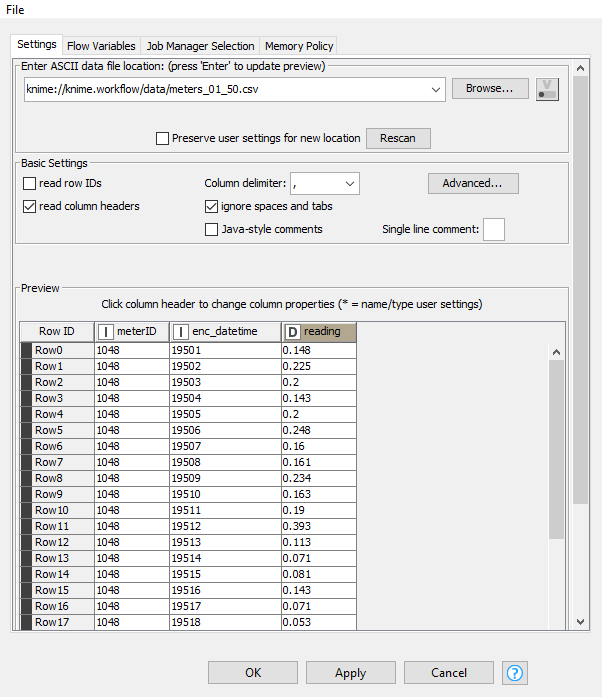
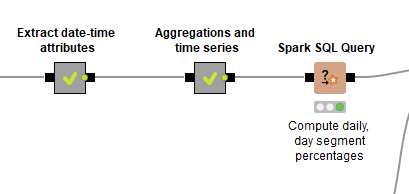

# Time Series - electric-production
Source resmi KNIME > https://kni.me/w/W78o4CE7oGCRkf51

## Overview
1. Knime workflow  

2. Agregation and Time Series  

3. Hasil deploy spark  

4. Hasil deploy spark to parquet  

## Dokumentasi
### Business Understanding
Workflow knime diatas mendemonstrasikan penggunaan time series untuk menganalisa rata-rat penggunaan listrik di irlandia. Hasil time series dibagi menjadi 9 yaitu:
1. Total penggunaan listrik
2. Penggunaan listrik per tahun
3. penggunaan listrik per bulan
4. Penggunaan listrik per minggu
5. Penggunaan listrik tiap hari dalam seminggu (tiap senen, tiap selasa dst)
6. Penggunaan listrik per hari
7. Penggunaan listrik per segmen dalam hari (tiap kurun jam tertentu)
8. Penggunaan listrik per hari kerja dan hari libur
9. Penggunaan listrik tiap jam tertentu

### Data Understanding

Data yang akan kita gunakan adalah meters_01_50.csv dengan keterangan sebagai berikut :

Dataset memiliki 44 baris data yang memiliki 3 kolom atribut dengan keterangan :
  - meterID = id meteran listrik
  - enc_datetime = data tanggal yang terenkripsi.
  - reading = nilai meteran pada meteran listrik

### Data Preparation

Tahapan ini kita mengubah dataset ke hive mengubahnya menjadi spark. Dikarenakan data sudah cukup bersih maka kita tidak perlu mencari field null dll. Kita hanya untuk mempersiapkan data untuk tahapan modeling.

#### Langkah-langkah data preparation
1. File reader > Membaca dataset meter  

2. Create Local Big Data Environment > Membuat semua fungsi local big data environment diantaranya Apache Hive, Apache Spark dan HDFS  

3. Load data > Meload dataset meter menjadi hive

  - DB Table Connector > Membuat tabel database baru dari dataset yang telah dibaca
  
  - DB Loader > Meload data banyak dari database Hive  
  
4. Hive to Spark > Mengimpor hasil dari query Hive inputan menjadi Spark sebagai DataFrame / RDD

### Modelling

Pada tahap ini kita akan mengolah DataFrame/RDD Spark hasil preparation dengan macam-macam spark sql node untuk menjabarkan kolom datetime menjadi bagian-bagian sesuai time series yang kita butuhkan.

#### Langkah - langkah modelling
1. Extract date-time atribut > Menjabarkan date time menjadi time series yg kita butuhkan. 
Node ini merupakan kumpulan Spark SQL Query dimana tiap querynya adalah sebagai berikut :

  - Initial datetime conversion
  
    Pada query diatas kolom reading akan di-rename menjadi kw30. Kemudian menambahkan kolom eventDate dan my_time. Berikut penjelasannya:
    - eventDate: hasil dari fungsi date_add (mengambil nilai interval antara tanggal 31-12-2008 dengan tiga digit pertama kolom enc_datetime).
    - my_time: mengambil nilai hh:mm, hh didapatkan dari ((digit ke-4 enc_datetime * 30) / 60 ) % 24. Diambil 2 digit dari hasil tersebut. sedangkan value mm, didapatkan dari ((digit ke-4 enc_datetime * 30) % 60 ) dan diambil 2 digit dari hasil tersebut.
  

  - Extract new datetime features
  
    Pada query diatas akan dihasilkan 5 kolom baru yaitu:
    - year: mendapatkan nilai tahun dari kolom eventDate
    - month: mendapatkan nilai bulan dari kolom eventDate
    - week: mendapatkan nilai minggu dari kolom eventDate
    - dayOfWeek: mendapatkan nilai nama hari dari kolom eventDate.
    - hour: mendapatkan nilai jam dari value pada kolom my_time.
  

  - Assign weekend / weekday
  
    Pada query diatas kita akan mendapatkan 1 kolom baru yaitu:
    - dayClassifier : Didapatkan ketika value dayOfWeek saturday / sunday maka dayClassifiernya `WE` selain itu dayClassifiernya `BD`
  

  - Assign hourly bins (daysegment)
  
    Pada query diatas kita akan mendapatkan 1 kolom baru yaitu:
    - daySegment : Didapatkan dari value hour dengan ketentuan:
      - Nilai hour >= 7 dan hour < 9, maka nilai daySegment 7-9
      - Nilai hour >= 9 dan hour < 13, maka nilai daySegment 9-13
      - Nilai hour >= 13 dan hour < 17, maka nilai daySegment 13-17
      - Nilai hour >= 17 dan hour < 21, maka nilai daySegment 17-21
      - Nilai hour >= 21 atau hour < 7, maka nilai daySegment 21-7
  

2. Aggregation and Time Series > Mendapatkan nilai rata-rata penggunaan listrik tiap time series yang kita inginkan
Dalam node ini dilakukan proses agregasi dengan menggunakan node sparks. Node-node yang digunakan antara lain :
  - Presist Spark DataFrame/RDD > Untuk mencache spark DataFrame agar mempercepat operasi-operasi yang menggunakan dataframe yang sama
  - Spark GroupBy > Melakukan group data sesuai dengan index yang kita inginkan. Selain itu kita juga bisa melakukan agregasi pada node ini
  - Spark Pivot > Melakukan pivoting pada Spark DataFrame / RDD yang diberikan menggunakan jumlah kolom yang dipilih untuk pengelompokan dan satu kolom untuk pivoting
  - Spark Coloumn Rename > Mengubah nama suatu kolom dari table
  - Spark Joiner > Menjoin 2 spark DataFrame seperti join pada database

Pada workflow diatas terdapat proses-proses :

  - Mencari total penggunaan listrik dengan cara:
    - SUM kolom kw30 dan groupby meterid
    
    
    - Rename kolom hasil sum menjadi totalKW
      
    Hasilnya menjadi  
    

  - Mencari rata-rata pengunaan listrik per tahun dengan cara:
    - SUM kolom kw30 dan groupby meterid, year
    
    
    - MEAN kolom SUM(kw30) dan groupby meterid
    
    
    - Rename kolom hasil MEAN menjadi avgYearlyKW
      
    Hasilnya menjadi  
    

  - Mencari rata-rata pengunaan listrik per bulan dengan cara:
    - SUM kolom kw30 dan groupby meterid, year, month
    
    
    - MEAN kolom SUM(kw30) dan groupby meterid
    
    
    - Rename kolom hasil MEAN menjadi avgMonthlyKW
      
    Hasilnya menjadi  
    

  - Mencari rata-rata pengunaan listrik per minggu dengan cara:
    - SUM kolom kw30 dan groupby meterid, year, week
    
    
    - MEAN kolom SUM(kw30) dan groupby meterid
    
    
    - Rename kolom hasil MEAN menjadi avgWeeklyKW
      
    Hasilnya menjadi  
    

  - Mencari rata-rata pengunaan listrik per dayofweek dengan cara:
    - SUM kolom kw30 dan groupby meterid, year, week, dayOfWeek
    
    
    - MEAN kolom SUM(kw30) dengan pivot dayOfWeek dan groupby meterid
    
    
    
    - Rename kolom hasil ditas menjadi avg[day].
      
    Hasilnya menjadi  
    

  - Penggabungan semua DataFrame/RDDs dengan menggunakan Spark joiner. Karena spark joiner hanya bisa menggabungkan 2 DataFrame/RDDs maka hasil workflow penggabungan menjadi seperti dibawah.
    
  Kita menggabungkan dengan inner join, dengan meterid sebagai key joinya. Serta menginclude semua kolomnya
  
  

3. Spark SQL Query > Melakukan sql query pada spark
Disini kita akan menghitung persentase dari penggunaan listrik per hari, dan pada hari saat periode jam tertentu. Dengan setinggan seperti dibawah

Maka hasilnya menjadi

### Evaluation

Proses selanjutnya kita akan mengevaluasi hasil time series kita. Kita menggunakan PCA, K-means, Scatter plot untuk melakukan visualisasi dari data yang telah dlklusterkan.
Hasil visualisasinya

### Deployment

  
Tahapan ini kita akan mendeploy hasil spark DataFrame dari proses wvaluation menjadi tabel hive dan parquet file menggunakan node dibawah

- Spark to Hive > Mengkonversi Spark DataFrame menjadi tabel hive
Konfigurasi
  
Hasil  

- Spatk to Parquet > Mengkonversi Spark DataFame menjadi parquet file
Konfigurasi
  
Hasil  

